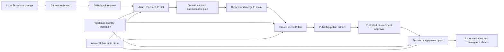

# Azure Identity, Infrastructure & Terraform Operations Lab

An end-to-end Azure operations project that began with identity, RBAC, Windows infrastructure, monitoring, and backup, then evolved into a Terraform-managed environment delivered through GitHub and Azure DevOps CI/CD.

The project demonstrates both sides of cloud operations: administering an existing environment safely and building a governed Infrastructure-as-Code workflow for repeatable change.

## Key outcomes

- Administered Microsoft Entra users, security groups, lifecycle actions, and group-based Azure RBAC.
- Validated Azure-hosted Windows Server, Active Directory, DNS, client trust, monitoring, alerting, backup, and file-level recovery.
- Built a separate Terraform-managed resource group, VNet, and four-subnet network without overlapping the original lab.
- Migrated Terraform state to Azure Blob Storage and verified remote locking and configuration convergence.
- Implemented GitHub feature branches and pull requests for infrastructure changes.
- Built Azure Pipelines stages for PR validation, authenticated planning, saved-plan artifacts, protected deployment approval, and Terraform apply.
- Used Workload Identity Federation and scoped Azure RBAC instead of storing a long-lived pipeline secret.
- Completed an end-to-end change from local HCL through PR review, automated CI, approval-gated CD, Azure deployment, and final validation.

## Technology

`Azure` · `Microsoft Entra ID` · `Azure RBAC` · `Terraform` · `Azure DevOps` · `Azure Pipelines` · `GitHub` · `Azure CLI` · `PowerShell` · `Windows Server 2022` · `Active Directory` · `Azure Monitor` · `Azure Backup`

## Environment

### Existing operations environment

| Layer | Details |
|---|---|
| Azure network | Existing VNet `10.10.0.0/16`, subnet `10.10.1.0/24` |
| Domain controller | `DC-01`, Windows Server 2022, AD DS, DNS, Splunk |
| Client | `Client-01`, joined to `SOC-LAB.LOCAL` |
| Cloud identity | Microsoft Entra ID users and cloud security groups |
| Protection | Recovery Services vault `rsv-soc-lab-backup` |

AD DS inside `DC-01` remains separate from Microsoft Entra ID. No synchronization was configured as part of this lab.

### Terraform-managed environment

| Resource | Configuration |
|---|---|
| Resource group | `rg-azure-iac-lab` in `eastus` |
| Virtual network | `vnet-azure-iac-lab` — `10.40.0.0/16` |
| Core subnet | `subnet-azure-iac-lab` — `10.40.1.0/24` |
| Application subnet | `subnet-azure-iac-apps` — `10.40.2.0/24` |
| Operations subnet | `subnet-azure-iac-operations` — `10.40.3.0/24` |
| Management subnet | `subnet-azure-iac-management` — `10.40.4.0/24` |
| Remote state | Azure Blob container `tfstate`, key `azure-iac-lab.tfstate` |

The `10.40.0.0/16` Terraform network was intentionally separated from the original `10.10.0.0/16` operations network. This preserved ownership boundaries and avoided trying to retroactively manage the existing environment before its dependencies were fully understood.

## Architecture

The original operations architecture is shown below.


The Terraform and CI/CD extension adds a controlled change-delivery layer:



See [Architecture Notes](architecture/architecture-notes.md) for identity, authorization, state, pipeline, network, and guest-OS boundaries.

## Completed project phases

| Phase | Work completed | Selected evidence |
|---|---|---|
| Environment review | Inventoried the existing Azure lab and preserved the manually managed boundary | [Azure resource inventory](screenshots/01-azure-resource-inventory.png) |
| Identity and lifecycle | Created Entra users/groups; validated a role change and full offboarding | [Security groups](screenshots/03-entra-security-groups.png), [blocked sign-in](screenshots/07-entra-offboarding-signin-blocked.png) |
| Azure RBAC | Assigned group-based roles at different scopes and tested effective access | [Scope assignments](screenshots/08-azure-rbac-group-scope-assignments.png), [effective access](screenshots/09-jordan-effective-rbac-access.png) |
| VM and domain operations | Validated domain-controller services, DNS, and the client secure channel | [Service health](screenshots/12-domain-controller-service-health.png), [DNS and trust](screenshots/13-client-dns-domain-trust-validation.png) |
| Monitoring and backup | Triggered a CPU alert and proved file-level recoverability | [Fired alert](screenshots/15-high-cpu-alert-fired.png), [file recovery](screenshots/16-file-level-recovery-success.png) |
| Terraform foundation | Deployed a dedicated resource group, VNet, and subnet from HCL | [Initial plan](screenshots/17-terraform-initial-plan.png), [successful apply](screenshots/18-terraform-apply-success.png) |
| Terraform change behavior | Tested creation, in-place update, replacement, destroy planning, and drift reconciliation | [In-place update](screenshots/21-terraform-update-in-place-plan.png), [replacement](screenshots/22-terraform-resource-replacement-plan.png), [drift detection](screenshots/24-terraform-drift-detection.png) |
| Remote state | Migrated state to Azure Blob Storage and verified locking and no-change convergence | [Remote state validation](screenshots/25-terraform-remote-state-azure-blob.png) |
| Git workflow | Used feature branches and pull requests for infrastructure changes | [Merged Terraform PR](screenshots/26-github-terraform-pull-request.png) |
| Terraform CI | Added formatting, validation, and authenticated planning in Azure Pipelines | [CI success](screenshots/27-azure-pipelines-terraform-ci-success.png), [authenticated plan](screenshots/28-azure-pipelines-authenticated-terraform-plan.png) |
| Approval-gated CD | Saved the deployment plan, published it as an artifact, required approval, and applied it | [Approval gate](screenshots/29-azure-pipelines-terraform-deployment-approval.png), [apply result](screenshots/30-azure-pipelines-terraform-apply-success.png) |
| End-to-end delivery | Delivered the management subnet through PR CI and the complete CD workflow | [PR plan](screenshots/32-azure-pipelines-pr-terraform-plan.png), [deployment](screenshots/33-azure-pipelines-end-to-end-terraform-deployment.png) |

## CI/CD control model

The pipeline separates review from deployment:

| Control | Purpose |
|---|---|
| Pull-request CI | Runs formatting, validation, and an authenticated plan; it cannot deploy the proposed change |
| GitHub review | Controls whether the HCL change is accepted into `main` |
| Main plan | Generates a fresh saved `tfplan` from the accepted source |
| Pipeline artifact | Carries the exact saved plan into the deployment stage |
| Protected environment | Pauses deployment for a separate human approval |
| Terraform apply | Applies the reviewed saved plan rather than generating an unreviewed plan during deployment |
| Post-deployment validation | Confirms the Azure result and checks that Terraform reports no remaining differences |

The pipeline authenticates through the Azure DevOps service connection `sc-terraform-azure-iac-lab` using Workload Identity Federation. Its Entra service principal was granted `Contributor` on `rg-azure-iac-lab` and `Storage Blob Data Contributor` on the state container—scoped permissions for infrastructure changes and remote-state access without a stored client secret.

## Repository guide

- [Terraform foundation](architecture/terraform-foundation.md) — managed resources, file responsibilities, backend, and change-safety checks
- [`azure-pipelines.yml`](azure-pipelines.yml) — PR CI, main-plan artifact, and approval-gated deployment stages
- [Terraform and CI/CD runbook](runbooks/terraform-cicd.md) — repeatable change and deployment procedure
- [Architecture notes](architecture/architecture-notes.md) — system boundaries and end-to-end control flow
- [Screenshot evidence index](screenshots/README.md) — descriptions and links for all validation evidence
- [Remote-state authorization incident](incidents/terraform-remote-state-403.md) — troubleshooting a Blob Storage `403`
- [Other incident documentation](incidents/) — identity, network, VM, DNS, RBAC, and backup scenarios
- [Lessons learned](lessons-learned.md) — operational and IaC takeaways
- [`scripts/`](scripts/) — PowerShell utilities for Azure inventory, lifecycle, RBAC, and identity validation

## Troubleshooting approach

The same evidence-first method was used across Windows operations and Infrastructure as Code:

```text
Reported symptom or failed stage
→ identify the failing layer
→ confirm identity, authorization, scope, state, and dependencies
→ compare intended state with observed evidence
→ make the smallest safe correction
→ rerun validation
→ verify the user, service, pipeline, or Azure outcome
→ document the root cause and result
```

For Terraform and Azure Pipelines, that means separating HCL syntax, provider initialization, Azure authentication, RBAC authorization, remote-state access, plan contents, approval state, and apply behavior rather than treating every pipeline failure as the same problem.

## What I learned

- A Terraform plan is a risk review: create, update, replace, and destroy actions require different levels of attention.
- Remote state is shared operational infrastructure and needs explicit access control, locking, and protection from source control.
- Authentication identifies the pipeline; Azure RBAC determines what it can do; scope determines where it can do it.
- Merging infrastructure code does not deploy infrastructure unless a separate delivery system performs the apply.
- PR approval and deployment approval solve different problems and provide two independent control points.
- A saved plan artifact keeps the reviewed change connected to the applied change.
- Final validation is not merely a green pipeline; it includes the Azure resource result and Terraform convergence.

## Related Windows infrastructure work

This project builds on the same Windows and Active Directory foundation documented in the related [printer-support lab](https://github.com/JoshuaKoshy973/soc-home-lab-active-directory-threat-detection/tree/main/printer-support-lab) and [file-permissions lab](https://github.com/JoshuaKoshy973/soc-home-lab-active-directory-threat-detection/tree/main/file-permissions-lab). Those projects cover print-server operations, SMB/NTFS access, least privilege, user-impact troubleshooting, and service-desk documentation.

The combined portfolio story is progression: first operate and troubleshoot an Azure-hosted Windows environment, then codify a separate Azure infrastructure boundary and deliver changes through authenticated, reviewable, approval-gated automation.
