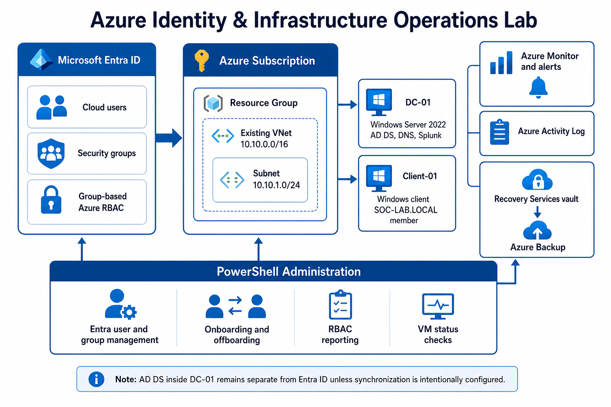

# Azure Identity & Infrastructure Operations Lab

An incremental Azure operations lab built on an existing Windows environment. It demonstrates cloud identity administration, group-based access control, VM health validation, monitoring, alert response, and safe backup recovery.

## What this demonstrates

- Microsoft Entra cloud users and security groups
- User lifecycle actions: membership changes, account disablement, and sign-in validation
- Azure RBAC assigned to groups at resource-group and VM scopes
- Effective-access testing for authorized and unauthorized users
- Windows domain, DNS, and secure-channel validation inside Azure-hosted VMs
- Azure Monitor metric review and fired-alert investigation
- Azure Backup job review and file-level recovery validation
- Evidence-driven documentation with repeatable operational checks

## Environment

| Layer | Details |
|---|---|
| Azure network | Existing VNet `10.10.0.0/16`, subnet `10.10.1.0/24` |
| Domain controller | `DC-01`, Windows Server 2022, AD DS, DNS, Splunk |
| Client | `Client-01`, joined to `SOC-LAB.LOCAL` |
| Cloud identity | Microsoft Entra ID users and cloud security groups |
| Protection | Recovery Services vault `rsv-soc-lab-backup` |

AD DS inside `DC-01` remains separate from Microsoft Entra ID. No synchronization was configured as part of this lab.

## Phase status

| Phase | Status | Evidence |
|---|---|---|
| Environment review | Completed | [Resource inventory](screenshots/01-azure-resource-inventory.png) |
| Entra users and groups | Completed | [Users](screenshots/02-entra-cloud-users.png), [groups](screenshots/03-entra-security-groups.png) |
| Lifecycle management | Completed | [Role membership](screenshots/04-entra-role-change-membership.png), [offboarding evidence](screenshots/05-entra-offboarded-account-disabled.png) |
| Azure RBAC | Completed | [Scope assignments](screenshots/08-azure-rbac-group-scope-assignments.png), [effective access](screenshots/09-jordan-effective-rbac-access.png) |
| VM and domain health | Completed | [Service health](screenshots/12-domain-controller-service-health.png), [DNS and trust](screenshots/13-client-dns-domain-trust-validation.png) |
| Monitor and alerting | Completed | [CPU spike](screenshots/14-client-cpu-utilization-spike.png), [fired alert](screenshots/15-high-cpu-alert-fired.png) |
| Backup and recovery | Completed | [Backup jobs](screenshots/11-azure-vm-backup-completed.png), [file recovery](screenshots/16-file-level-recovery-success.png) |

## Architecture



See the [architecture notes](architecture/architecture-notes.md) for the control-plane, guest-service, identity, network, and data-protection boundaries.

## Documentation

- [Screenshot index](screenshots/README.md)
- [Onboarding runbook](runbooks/onboarding.md)
- [Offboarding runbook](runbooks/offboarding.md)
- [Identity and RBAC runbook](runbooks/identity-and-rbac.md)
- [VM operations runbook](runbooks/vm-operations.md)
- [RDP and NSG troubleshooting](runbooks/rds-and-nsg-troubleshooting.md)
- [DNS and domain-resource troubleshooting](runbooks/dns-and-domain-resource-troubleshooting.md)
- [File-share permissions](runbooks/file-share-permissions.md)
- [Backup and recovery runbook](runbooks/backup-recovery.md)
- [Lessons learned](lessons-learned.md)
- [Incident documentation](incidents/)

## Incident library

- [RDP unavailable because of an NSG rule](incidents/rdp-unavailable-nsg.md)
- [Domain resources unavailable because of client DNS](incidents/client-dns-misconfiguration.md)
- [User cannot manage resources because of missing RBAC](incidents/missing-rbac-access.md)
- [VM lifecycle operation stuck in Deallocating](incidents/vm-deallocating.md)
- [Offboarding access verification](incidents/incomplete-offboarding.md)
- [Backup restore troubleshooting](incidents/backup-restore-failure.md)

## Automation

The [`scripts/`](scripts/) directory contains focused PowerShell utilities for VM inventory and lifecycle operations, RBAC reporting, and identity workflow validation. Read-only reporting commands are separated from state-changing actions, and lifecycle actions support PowerShell's `-WhatIf` safety pattern.

The project is organized around practical identity, access, operations, monitoring, and recovery workflows. Screenshots provide evidence for the key configuration and validation steps.

## Operating model

The lab follows a service-operations workflow rather than treating each task as an isolated portal click:

```text
Reported symptom
→ scope and business impact
→ identity, network, guest OS, or Azure control-plane evidence
→ smallest safe corrective action
→ user or service validation
→ documented root cause and follow-up
```

This separation is important because a user-facing symptom does not identify the failing layer. Azure RBAC, NSGs, Windows logon rights, SMB/NTFS permissions, DNS, and guest services each control different parts of the end-to-end experience.

## Related Windows infrastructure work

This project builds on the same Windows and Active Directory foundation documented in the related [printer-support lab](https://github.com/JoshuaKoshy973/soc-home-lab-active-directory-threat-detection/tree/main/printer-support-lab) and [file-permissions lab](https://github.com/JoshuaKoshy973/soc-home-lab-active-directory-threat-detection/tree/main/file-permissions-lab). Those projects cover print-server operations, SMB/NTFS access, least privilege, user-impact troubleshooting, and service-desk documentation.

## Portfolio focus

The strongest theme across the projects is layered troubleshooting: identify whether the issue is identity, authorization, network, Windows service, application, or data protection; then make the smallest change that restores the required business function.
