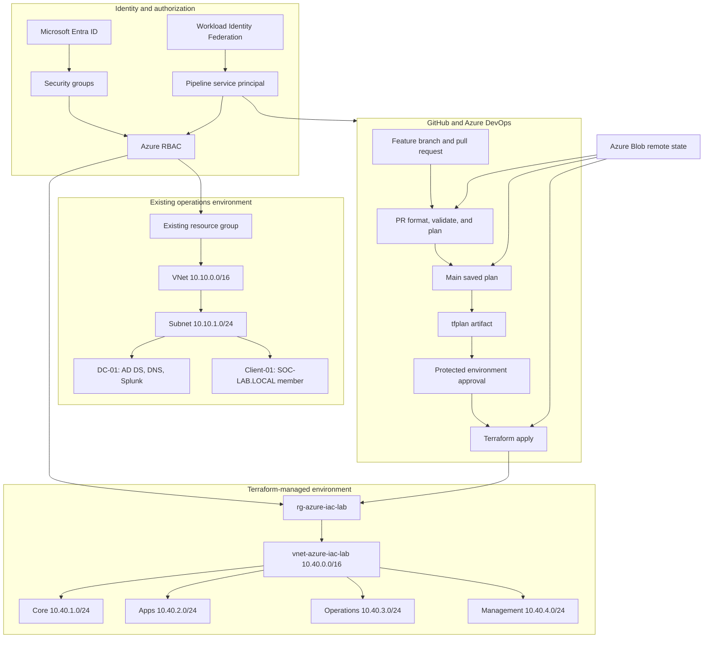

# Architecture Notes

## System overview

The lab contains two Azure infrastructure boundaries and one change-delivery system:

1. The original operations environment hosts the Windows and identity workloads used for Entra, RBAC, VM, DNS, monitoring, and backup exercises.
2. The Terraform environment provides a separate network boundary for learning desired-state infrastructure and repeatable change.
3. GitHub and Azure DevOps control how Terraform changes are reviewed, planned, approved, and applied.



## Network and ownership boundaries

The original VNet uses `10.10.0.0/16`; the Terraform VNet uses `10.40.0.0/16`. Keeping the address spaces separate prevented overlap and made resource ownership explicit.

The existing Windows environment was intentionally not imported into Terraform. Importing a resource changes Terraform’s state relationship, not the live resource itself, and should be attempted only after configuration, dependencies, lifecycle behavior, and operational ownership are understood.

## Identity boundaries

Microsoft Entra ID controls cloud identity. Azure RBAC controls Azure management-plane authorization. Active Directory Domain Services inside `DC-01` controls the Windows domain, domain DNS, Windows logon, and access to guest resources.

These are separate systems in this lab. Azure `Contributor` does not grant Windows domain access, and a domain account does not automatically grant Azure management permissions.

The Azure DevOps pipeline uses a separate Entra application/service principal created through the service connection. Workload Identity Federation lets Azure DevOps obtain short-lived access without storing a long-lived client secret.

## Pipeline authorization boundary

The pipeline identity has two scoped responsibilities:

- `Contributor` on `rg-azure-iac-lab` for Terraform-managed resources.
- `Storage Blob Data Contributor` on the `tfstate` container for backend reads, writes, and locking.

Authentication, authorization, and scope are separate questions:

```text
Who is calling Azure?
→ What role does that identity have?
→ At which scope is the role effective?
→ Does that scope include both the target resources and the state backend?
```

## Terraform state boundary

Terraform compares three sources when generating a plan:

```text
HCL configuration
↔ Terraform state
↔ Actual Azure resources
```

The backend stores `azure-iac-lab.tfstate` in the `tfstate` Blob container. The repository ignores local state, plans, `.terraform` working directories, and variable files that may contain sensitive values.

Remote state supports a shared source of state and state locking. It is not a substitute for access control, backup, or careful review because state can contain resource identifiers and sensitive attributes.

## CI and CD boundaries

Pull-request CI performs formatting, validation, and an authenticated plan. It previews the proposed change but does not deploy it.

After approved code reaches `main`, the pipeline generates a fresh saved plan and publishes it as the `terraform-plan` artifact. The deployment job downloads that exact artifact, waits at the protected `azure-iac-lab` environment, and applies the saved plan after approval.

```text
PR approval: should this source change enter main?
Deployment approval: should this reviewed plan change Azure now?
```

Those approvals are intentionally separate.

## Azure control plane and guest-services boundary

The Azure control plane manages VMs, NICs, disks, VNets, NSGs, monitoring rules, and backup configuration. The guest operating system provides Windows services, domain authentication, DNS behavior, RDP, SMB, and local firewall policy.

An Azure VM can be running while RDP, DNS, a Windows service, or an application is unavailable. Conversely, an NSG can block traffic while the VM and its Windows services remain healthy.

## Monitoring and data-protection boundaries

Azure Monitor observes platform metrics and evaluates alert rules. An alert is evidence of a condition, not automatically its cause.

Azure Backup protects the VM through the Recovery Services vault. A completed backup job proves protection activity; the file-level recovery test proves that selected data was recoverable and readable.

## End-to-end validation standard

A successful infrastructure change is complete only when all relevant layers agree:

1. Terraform formatting and validation pass.
2. The plan contains only the intended actions.
3. The pull request is reviewed and merged.
4. The main pipeline creates and publishes a saved plan.
5. The deployment receives explicit approval.
6. Terraform applies the saved plan successfully.
7. Azure displays the intended resource and configuration.
8. A final plan reports no differences between HCL, state, and Azure.
