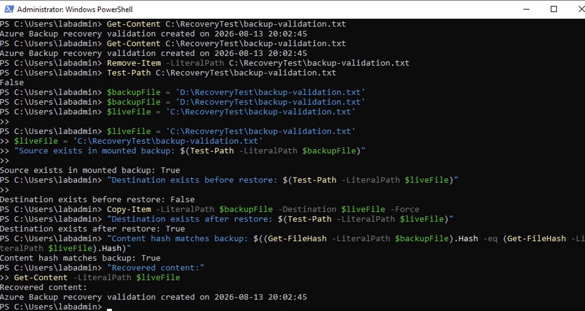
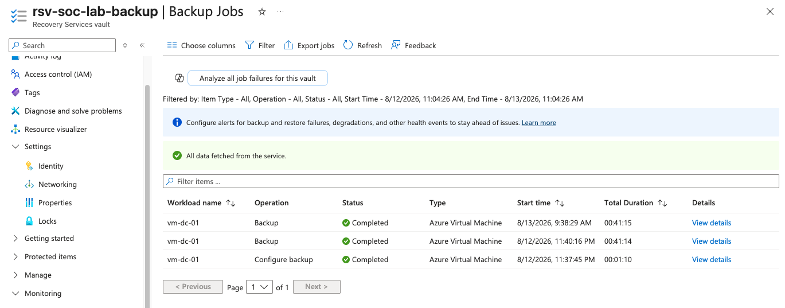

# Backup Restore Failure

## Ticket summary

**Ticket:** `INC-2142`
**Priority:** Medium
**Affected service:** Azure VM Backup and file recovery
**Affected resource:** `vm-dc-01`

## Reported symptom

An administrator reported that a file expected from an Azure VM recovery point was not present at the restore destination. The recovery job appeared to complete, but the user could not locate or validate the recovered file.

## Scope and business impact

The issue was limited to the recovery workflow; the source VM remained available. The business impact was uncertainty about whether the protected data could actually be recovered, which is more serious than simply having a successful backup job.

## Troubleshooting sequence

1. Confirm the recovery point, protected item, source VM, and requested file path.
2. Review the Recovery Services vault backup job and operation details.
3. Confirm the recovery point timestamp is earlier than the deletion or loss event.
4. Verify that the selected restore method matches the requirement: file-level recovery, restore to a new location, or full VM restore.
5. Confirm the mounted recovery source and inspect the expected directory structure.
6. Confirm the destination path and available storage.
7. Check whether the file exists under a different restored folder or name.
8. Compare the recovered file’s content hash with the source or mounted-backup copy.
9. If the restored content is valid, communicate the path and close the recovery task.
10. If validation fails, preserve the evidence, avoid overwriting the source, and escalate with the recovery-point ID and job details.

## Root-cause possibilities

- Incorrect recovery point selected
- File restored to an unexpected destination
- Wrong restore mode selected
- Mount or copy operation completed without the expected source path
- Destination validation was omitted
- Recovery job completed, but file-level content was not verified

## Corrective action

Use a non-production destination for validation, repeat the file-level recovery from the correct recovery point, and verify existence, content, and hash before communicating success. Do not treat a green backup job as proof that a requested file was recovered.

## Validation evidence

The successful recovery workflow in this lab verified that the destination existed after restore, the content hash matched the backup source, and the recovered content was readable:

The Recovery Services vault also showed completed backup jobs for the protected VM:

## Lesson learned

Recovery is a separate operational capability from backup. The final test must answer the user’s question—“Can I get the required data back?”—not only the platform question—“Did the backup job complete?”
