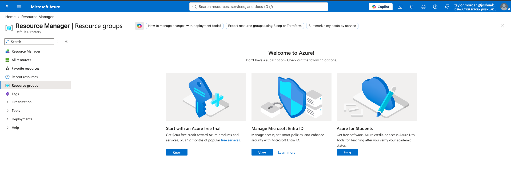

# Missing User Access

## Scenario

Taylor Morgan was used as a negative-access validation account. The Azure portal displayed the welcome experience rather than subscription or resource-group resources, demonstrating that the account had no effective Azure access.

## Troubleshooting approach

1. Confirm the signed-in identity and tenant.
2. Check subscription and resource-group visibility.
3. Review direct and group-based Azure role assignments.
4. Compare the result with an authorized user such as Jordan Reed.
5. Correct only the approved group membership or role assignment, then retest.

## Evidence

The validation confirms the no-access state and provides a clear investigation path through identity, group membership, and RBAC scope.
