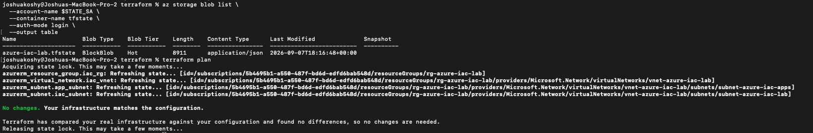

# Terraform Remote State Authorization Failure

## Incident summary

**Affected service:** Terraform Azure Blob backend  
**Affected workflow:** Local state migration and pipeline initialization  
**Impact:** Terraform could authenticate to Azure but could not read or write the remote state object

## Reported symptom

During migration from local Terraform state to Azure Blob Storage, backend access returned HTTP `403 Forbidden`. Azure CLI authentication was already successful, so the failure had to be isolated between identity, Azure Resource Manager permissions, and Blob data-plane permissions.

## Scope

The target infrastructure in `rg-azure-iac-lab` remained available. The failure affected the state-management path and blocked safe shared planning or deployment until remote-state access was corrected.

## Investigation

1. Confirmed the active Azure CLI identity, tenant, and subscription.
2. Confirmed the backend storage account, `tfstate` container, and `azure-iac-lab.tfstate` key.
3. Confirmed the storage account and container existed.
4. Distinguished management-plane access to the storage resource from data-plane access to Blob contents.
5. Reviewed the effective Azure role assignments for the authenticated identity.
6. Identified that the identity did not have the required Blob data permission at the state-container scope.
7. Granted `Storage Blob Data Contributor` on the `tfstate` container.
8. Reinitialized Terraform and retried backend access.

## Root cause

The authenticated identity could access Azure but lacked the Blob data-plane authorization required by the Terraform backend. General Azure authentication and resource visibility did not provide permission to read, write, or lock the state blob.

## Corrective action

Granted `Storage Blob Data Contributor` at the narrow state-container scope rather than broadening permissions across the subscription or storage account unnecessarily.

## Verification

Terraform successfully acquired the remote state lock, refreshed the managed resources, reported no configuration differences, and released the lock. The Blob listing showed the `azure-iac-lab.tfstate` object.

## Lesson learned

Authentication answers who the caller is; authorization answers what the caller may do; scope answers where that permission applies. Terraform remote state uses the Blob data plane, so a role that permits infrastructure management does not automatically permit state access.

## Prevention

- Document the backend resource, container, state key, and required data role.
- Grant the role at the narrowest practical scope.
- Verify both local and pipeline identities independently.
- Keep state and saved plans out of Git.
- Preserve backend errors and correlation details before changing permissions.
