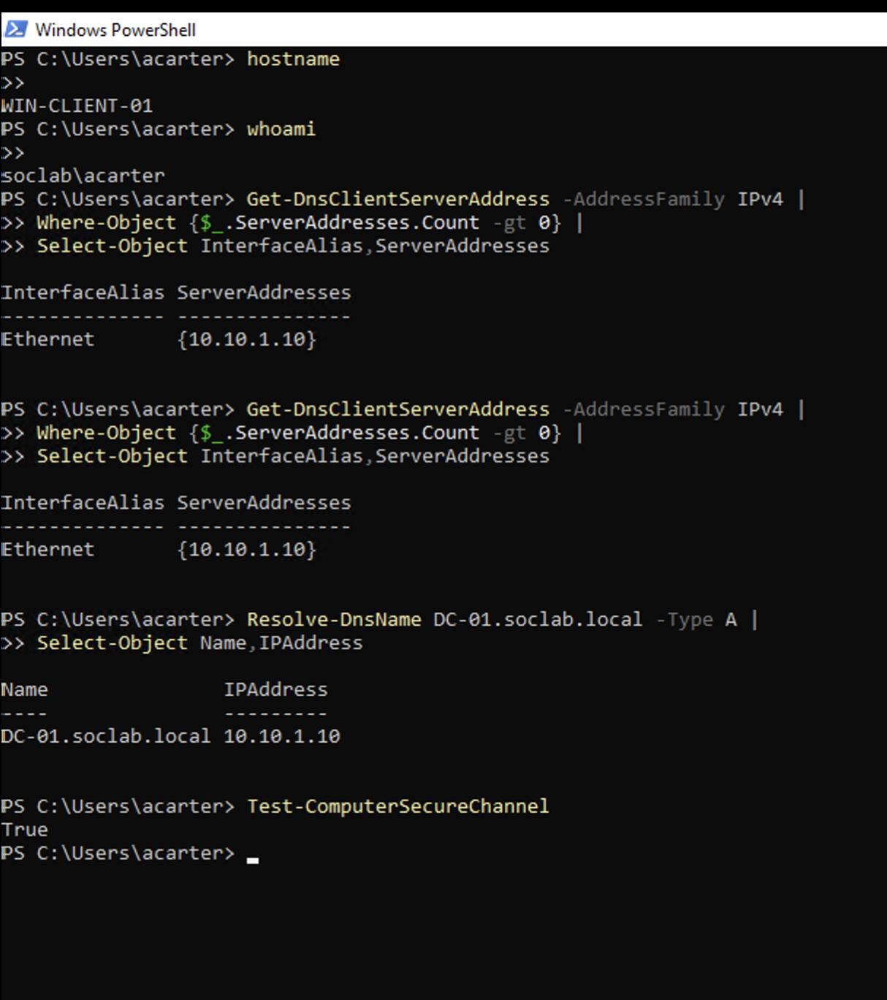

# DNS and Domain Resource Troubleshooting Runbook

## Purpose

Use this workflow when a domain-joined Azure client can start and accept local access but cannot reliably authenticate, resolve internal names, or reach domain resources.

## Procedure

1. Determine whether the client has basic network connectivity.
2. Run `ipconfig /all` and identify the active interface and DNS servers.
3. Compare the configured DNS server with the domain design.
4. Resolve the domain controller by hostname and FQDN.
5. Verify domain authentication and the current user identity.
6. Test the computer secure channel.
7. Verify the SMB path or other internal resource.
8. Check the server only after client DNS and network dependencies are validated.
9. Correct the client DNS configuration, refresh the client if required, and repeat the tests.

## Useful checks

```powershell
Get-DnsClientServerAddress -AddressFamily IPv4 |
    Where-Object { $_.ServerAddresses.Count -gt 0 } |
    Select-Object InterfaceAlias, ServerAddresses

Resolve-DnsName DC-01.soclab.local -Type A |
    Select-Object Name, IPAddress

Test-ComputerSecureChannel
```

## Diagnostic distinction

A file-share symptom can originate at the client network layer. A domain client should use the domain’s DNS infrastructure; an arbitrary custom DNS server can prevent domain-controller discovery, authentication, and internal name resolution.

## Evidence



The evidence shows the client identity, the domain DNS server at `10.10.1.10`, resolution of `DC-01.soclab.local`, and a successful secure-channel result.
